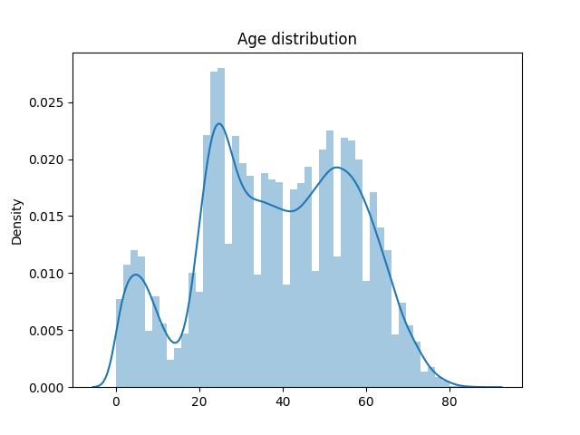
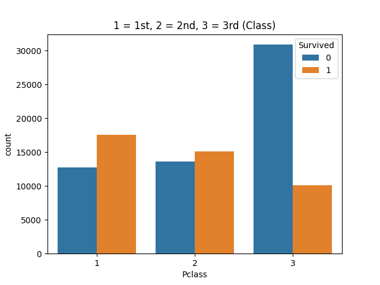
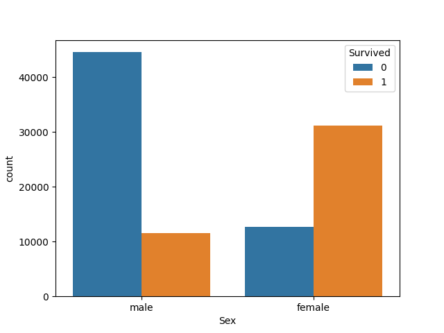
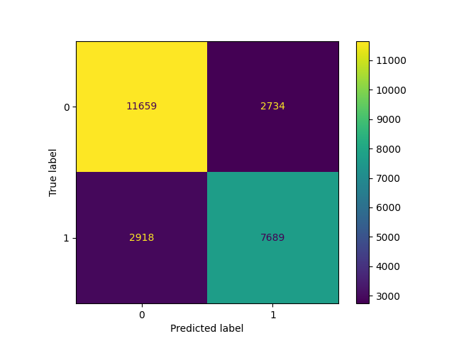
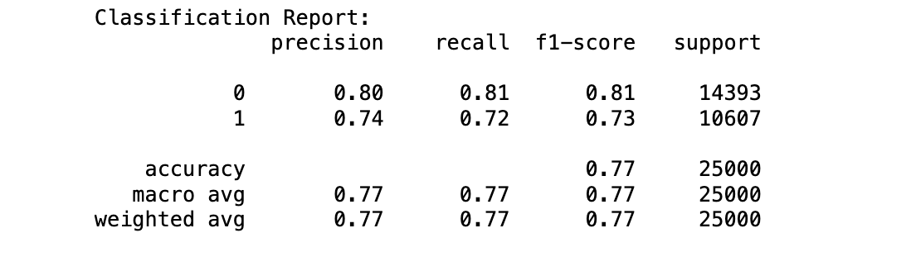
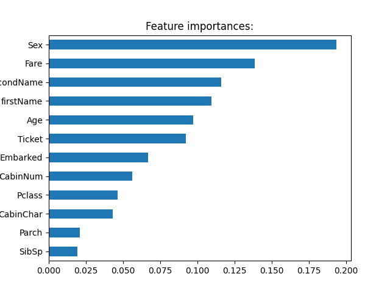

<div align="center">
    <h1>Survived Prediction</h1>
</div>

## Kaggle competition (Kaggle dataset):

### Introduction
Use machine learning to create a model that predicts which passengers survived the Titanic shipwreck.

### Repository Structure
* **README.md**: The top-level README for reviewers of this project
* **requirements.txt**: requirements file; including the needed tools
* **notebooks**: 
    - **01.data_exploration.ipynb**: Visualizing the dataset and getting the first touch with the data.
    - **02.data_processing.ipynb**: Clean and transfer some features with automatic functions.
    - **03.model.ipynb**: Random forest classifier model.

### Libraries
* pandas
* NumPy
* seaborn
* matplotlib
* scikit-learn

### Algorithm
* Random forest

## Getting the notebooks running localy with Jupyter
1. Colone this repo
```
git clone https://github.com/khalidsbn/Survived-prediction.git
```
2. Open the notebooks with Jupyter 


## Here is a quick summary of the project

Here some plots from data exploration:

Age districution of the passengers:


There are three classes to book on the Titanic ship. Here are the passengers who survived and who didn't in each class.


Male and female who survived and who didn't:


Confusion Matrix:


Classification repot:


Feature importances:

